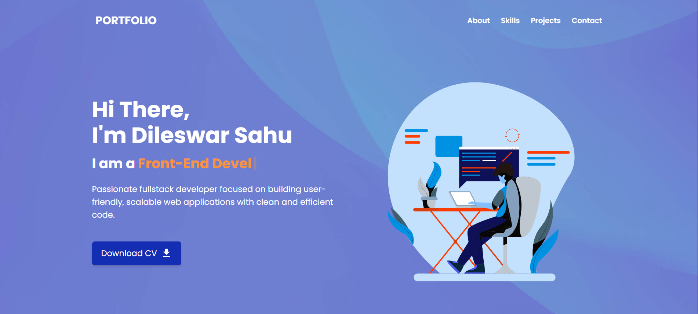
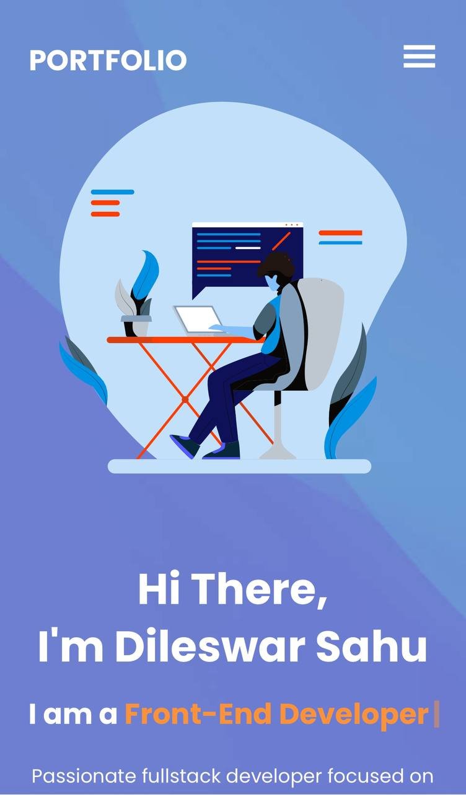

# 💼 Dilesh Portfolio

🔗 [View Live Portfolio](https://6892619fc8a503f8685f3329--dileswarsahu.netlify.app)

A modern and responsive developer portfolio built using **React** and **Tailwind CSS**. Showcases personal projects, skills, and contact information — ideal for sharing with potential employers or clients.

---

## 🚀 Features

- ✨ Clean and minimal design
- 📱 Responsive layout (mobile-friendly)
- 💻 Built with React & Tailwind CSS
- 🔗 Smooth scroll navigation
- 📂 Project showcase section
- 📞 Contact form integration (customizable)

## 🛠️ Tech Stack

- **React** – Frontend library
- **Tailwind CSS** – Utility-first CSS framework
- **React Icons** – Icon support
- **React Router DOM** – Page routing and navigation

